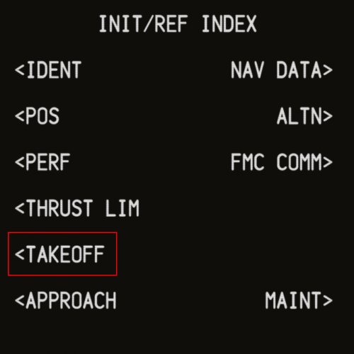
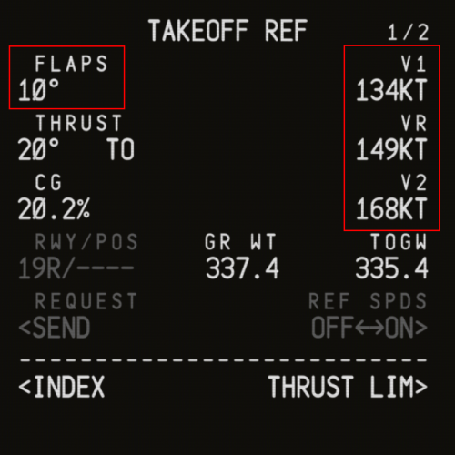
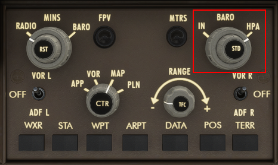
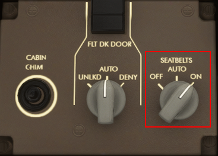

# Before Start

## TAKEOFF Page

Press the `INIT REF` button on the CDU. From the `INIT/REF INDEX` page, navigate to the `TAKEOFF` page.

On the takeoff page, we will have to enter the flaps setting as well as the v-speeds. To get your v-speeds, simply press the LSK next to the empty fields (`---`), and it will populate automatically.

:::info
The only valid takeoff flaps settings on the 747 are `10` and `20`.
:::

## EFIS Control Panel

### QNH

To set the QNH, use the baro knob on the EFIS control panel. The outer knob toggles between units (inches of mercury and hectopascals) while the inner knob sets the value.

The QNH is displayed in the bottom right corner of the Primary Flight Display (PFD).

:::tip
It is possible to request the METAR through ACARS in the 74S.
:::

### ENG Page

In order to see detailed engine parameters, press the `ENG` button to display the engine synoptic page on the lower EICAS display.

## MCP

On the MCP, do the following:
* Turn the `F/D` (Flight Director) switches to the `ON` position.
* Turn the `A/T ARM` (Autothrottle) switch to the `ARM` position.
* Using the knob under the `IAS/MACH` display, set the speed to the `V2` speed from the CDU `TAKEOFF` page.
* Using the altitude knob, set the selected altitude to the cruising altitude.
* Arm LNAV and VNAV by pressing the `LNAV` and `VNAV` switches.

## Center Instrument Panel

Set the `AUTOBRAKE` knob into the `RTO` (Rejected Takeoff) position.

## Aft Aisle Stand

Set the `SEATBELTS` knob into the `ON` position. It is located behind the radio tuning panel.