# Initial CDU Setup

Now that you have powered up the aircraft, it is time to set up the CDU (Central Display Unit). In this section we will be inserting the flight plan and all the necessary information from our OFP.

## Loading Fuel and Payload
Follow [this guide](/docs/guides/w&b) on how to load fuel and cargo into the aircraft.

## The CDU

The CDU is where we input our route, performance data, and in the case of the 74S, load the aircraft with passengers and cargo.

Highligted in the image above are the LSKs (Line Select Keys). There are right and left LSKs. The LSK next to the `SALTY` text in the image above would be referred to as `LSK 5R`, with the number representing one of the 6 buttons on each side. We will be referring to these buttons this way from now on.

:::tip
If this is your first time in the aircraft, now may be a good time to set some settings according to your preferences. Press `LSK 5R` to get into the `SALTY OPTIONS` menu. From here you can adjust settings such as the units.
:::

### POS INIT Page

Press `LSK 1L`.

The `IDENT` page should appear. From here, press `LSK 6R` to show the `POS INIT` page.

Using the keypad, type the ICAO code of your present airport. If you are following our route, this will be `ENGM`. Once you have typed the code in, press `LSK 2L` to put it into the `REF AIRPORT` field.

Now, the coordinates of the airport will appear. Copy the coordinates by pressing `LSK 2R`, and put them into the `SET IRS POS` field by pressing `LSK 6R`. This is required for IRS alignment.

### ROUTE Page

Press `LSK 6R` in order to display the `ROUTE` page. This is where we will be inputting our flight plan.

:::note
This guide will teach you how to manually input your route into the CDU. If you'd prefer importing from SimBrief, follow [this guide](/docs/guides/simbrief).
:::

Fill in the appropriate data into the `ORIGIN`, `DEST` and `FLT NO` fields. If you are following our flight plan, your CDU should look the same as in the image above.

Press the `NEXT PAGE` button to access page 2 of the `ROUTE` page.

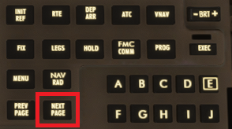

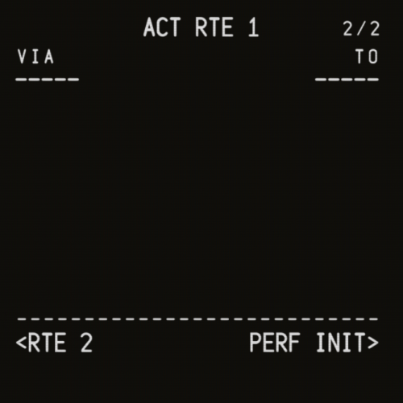

Here is where we will input our waypoints and airways.

* **`VIA` Field** - Airways (leave empty for direct)
* **`TO` Field** - Waypoints

Start filling out waypoints and airways, pressing `NEXT PAGE` as needed.

:::info
If your route is fairly long, you are almost certainly going to encounter the `WPT SELECT` page when inputting waypoints. In some cases, there are multiple waypoints with the same name, and you need to tell the CDU which one in particular you want. You should cross-check the coordinates with your OFP, however in this case the first option is the correct one.

:::

Once you are done filling out the flight plan, activate it by pressing `LSK 6R`.

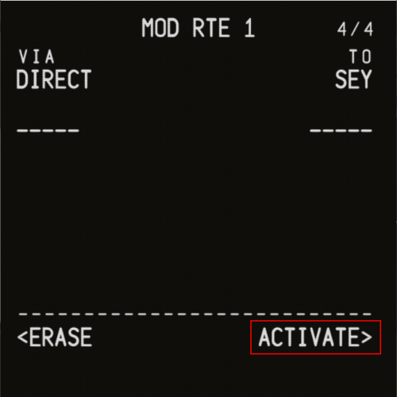

Then, execute by pressing the `EXEC` button with the green light.

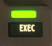

You have now successfully set up your flight plan!

### PERF INIT Page

Press `LSK 6R` to display the `PERF INIT` page.

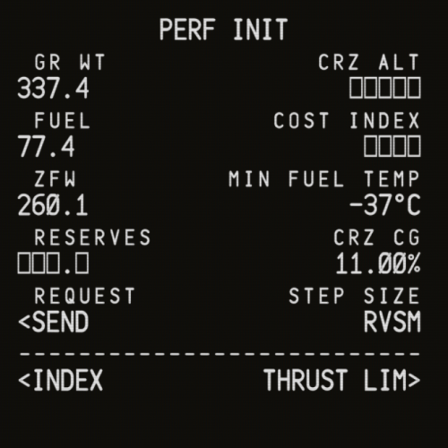

Populate the `CRZ ALT`, `COST INDEX` and `RESERVES` fields with the appropriate values. You can calculate the reserve fuel by adding the `ALTN` and `FINRES` fuel values from your OFP.

It is also possible to use SimBrief uplink by pressing `LSK 5L` (`SEND`).

### THRUST LIM Page

Press `LSK 6R` to display the `THRUST LIM` page.

We will be selecting the `TO 1` and `CLB 1` options, which will derate the engine thrust.

:::note
This feature is currently not functional in the 74S and the thrust limit will always be set to 85% regardless of the option selected.
:::

### DEP/ARR Page

Press the `DEP ARR` button to display the `DEP/ARR` page.

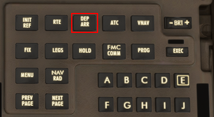

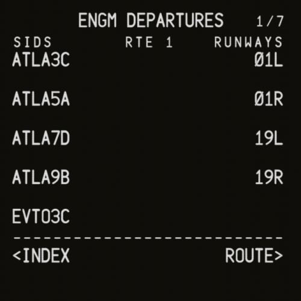

Select the appropriate runway and departure. If you are following our route, this will be runway `19R` and `ATLAP7D`. Once you have selected the runway and departure, press the `EXEC` button.

In order to now select the arrival, you must press `LSK 6L` to display the `DEP/ARR INDEX` page.

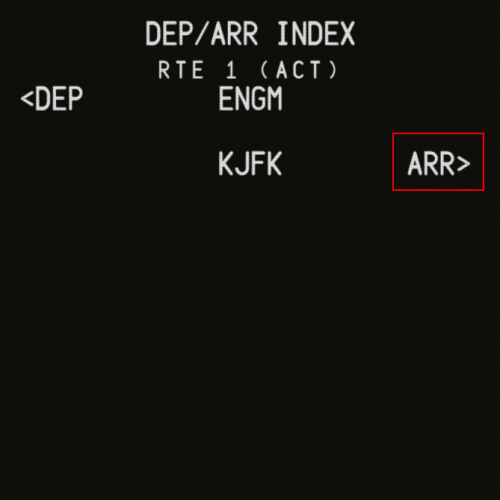

Select `ARR` and follow the same procedure as with the departure.

## Checking for abnormalities

Now that your route has been inserted, it is a good idea to check for any abnormalities. Press the `LEGS` button to display the `LEGS` page.

On the EFIS control panel, turn the map mode to `PLN` mode, and turn up the range to a reasonable amount. This will allow you to step through the legs to preview the route.

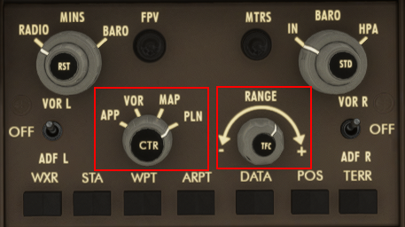

You can now press `LSK 6R` to step through the legs and see the route on the ND (Navigation Display).

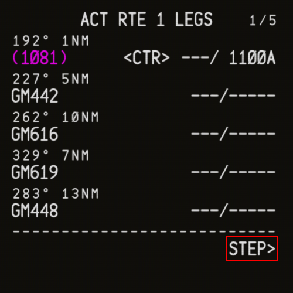

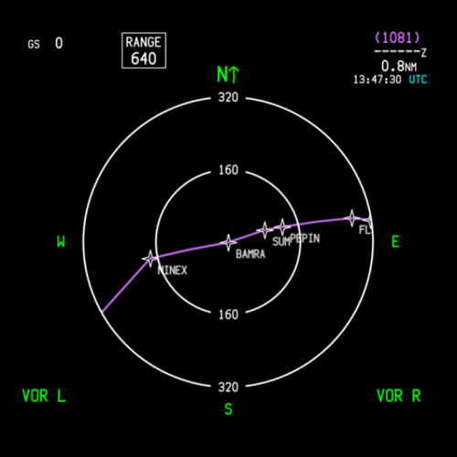

:::info
Discontinuities and vectors are normal and should not be blindly removed.
:::