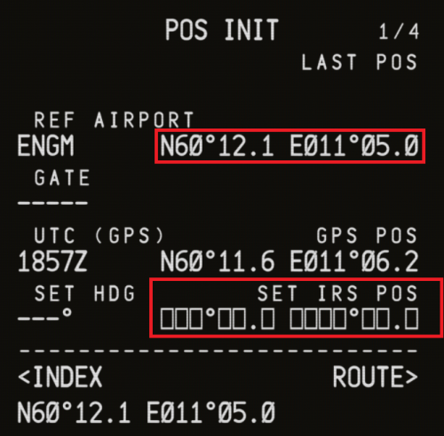

# CDU Configuration

Now that you have powered up the aircraft, it is time to set up the CDU (Central Display Unit). In this section we will be inserting the flight plan and all the necessary information from our OFP.

## The CDU

The CDU is where we input our route, performance data, and in the case of the 74S, load the aircraft with passengers and cargo.

Highligted in the image above are the LSKs (Line Select Keys). There are right and left LSKs. The LSK next to the `SALTY` text in the image above would be referred to as `LSK 5R`, with the number representing one of the 6 buttons on each side. We will be referring to these buttons this way from now on.

:::tip
If this is your first time in the aircraft, now may be a good time to set some settings according to your preferences. Press `LSK 5R` to get into the `SALTY OPTIONS` menu. From here you can adjust settings such as the units.
:::

### POS INIT Page

Press `LSK 1L`.

The `IDENT` page should appear. From here, press `LSK 6R` to show the `POS INIT` page.

Using the keypad, type the ICAO code of your present airport. If you are following our route, this will be `ENGM`. Once you have typed the code in, press `LSK 2L` to put it into the `REF AIRPORT` field.

Now, the coordinates of the airport will appear. Copy the coordinates by pressing `LSK 2R`, and put them into the `SET IRS POS` field by pressing `LSK 6R`. This is required for IRS alignment.