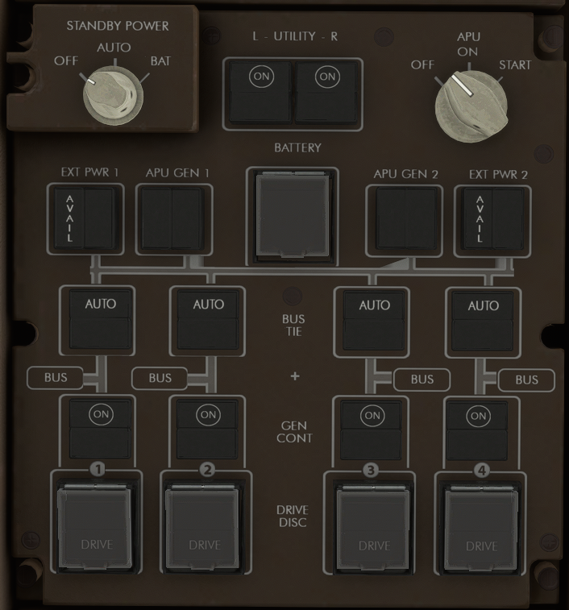
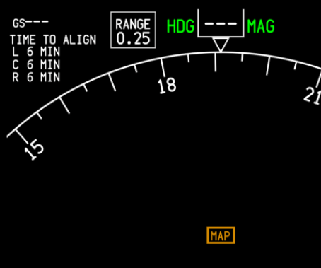
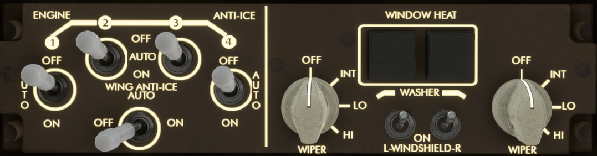

# Powering up the aircraft

## Overhead Panel

### Electrical

Firstly, click on the `BATTERY` pushbutton in order to lift the cover. Then, press the button to turn it on. Verify that the `OFF` light on the button is extinguished.

Turn the `STANDBY POWER` knob into the `AUTO` position. You should now be hearing some noise and see some lights turn on.

Lastly, verify that the `BUS TIE` buttons are in the `AUTO` position (pressed in). Push the `EXT PWR 1` and `EXT PWR 2` switches.

:::info
Depending on the airport, you may not have external power available. If this is the case, the `AVAIL` light will not be illuminated on the `EXT PWR 1/2` switches, and you will need to use the APU (Auxilliary Power Unit) to power up the aircraft. Turn the `APU` knob to the `START` position. The knob will automatically spring back to the `ON` position. After the `AVAIL` lights illuminate on the `APU GEN 1/2` switches, press the switches. You should not encounter this if using the provided route.
:::

### Lighting

Put the `NAV` light into the `ON` position, and the `BEACON` light into the `LWR` position. If required, adjust the interior glareshield, flood or dome lights.

### IRS Alignment

Before the aircraft moves, we must align the IRS (Inertial Reference System). Turn the 3 `IRS` knobs located in the top left of the overhead panel into the `NAV` position.

The IRS should now be aligning. This will take a couple minutes. It is possible to see the time remaining in the top left corner of the ND (Navigation Display).

### Window Heat

Push the `WINDOW HEAT` switches into the `ON` position.