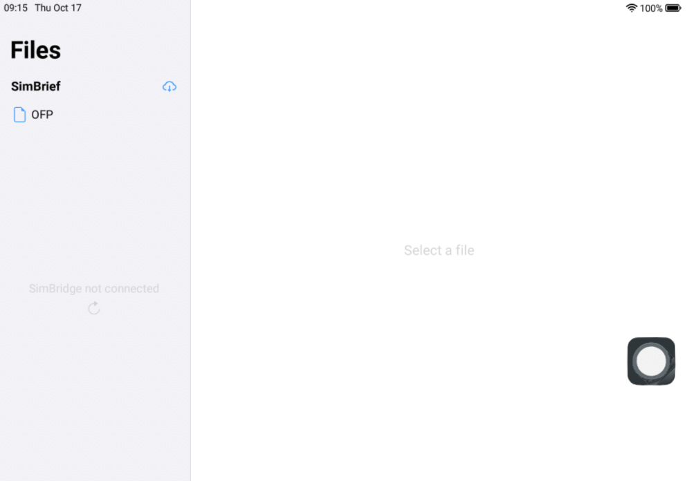

# Files

This app allows you to view your SimBrief OFP and view local documents and images through FlyByWire SimBridge.

## OFP

:::note

This section assumes you have set up SimBrief in the [Settings app](./settings) or CDU.

:::

View your SimBrief OFP by clicking `OFP`

## Viewing local files

:::note

This section requires FlyByWire SimBridge to be installed and running. If it is running and you are still getting the `SimBridge not connected` message, click on the refresh button and make sure it is running on the correct port.

:::

The list is comprised of every compatible file in your SimBridge `images` and `pdfs` folders.

### Controls

From top to bottom:
- Zoom in
- Zoom out
- Rotate right
- Rotate left

For PDF documents, an additional component is displayed in the top left corner, showing the current page, total number of pages and buttons to switch between pages.