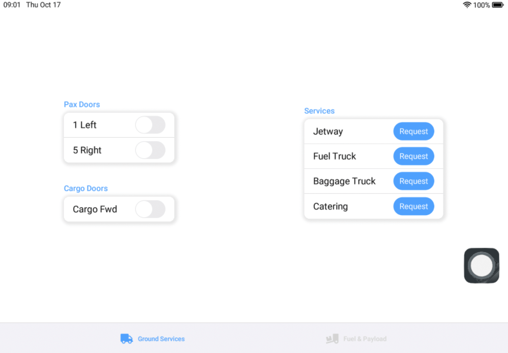
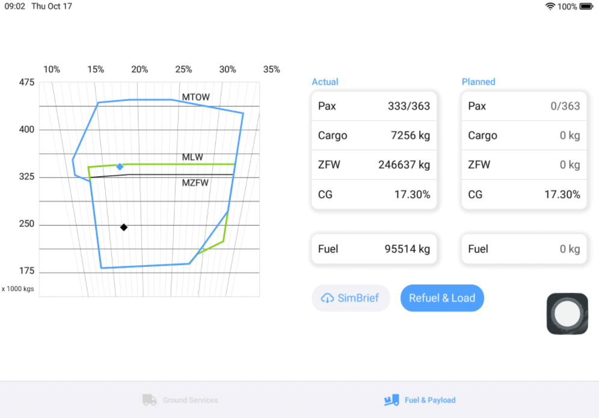

# Ground

This app allows you to request default MSFS ground services, control doors and load the aircraft.

## Ground services

## Fuel & Payload

Click on the `SimBrief` button to fetch your weights from SimBrief.

:::note

Units are based on your global MSFS units settings.

:::

### CG limits chart

* MTOW (blue): take-off limits
* MLW (lime): landing limits
* MZFW (black): zero-fuel weight limits