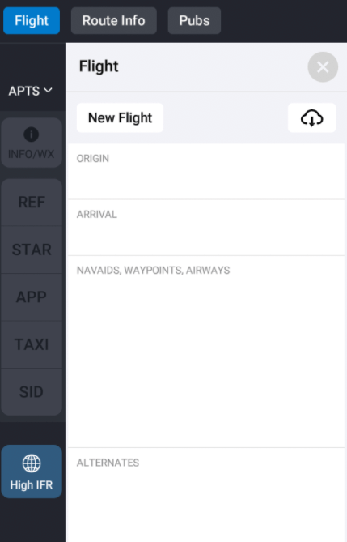
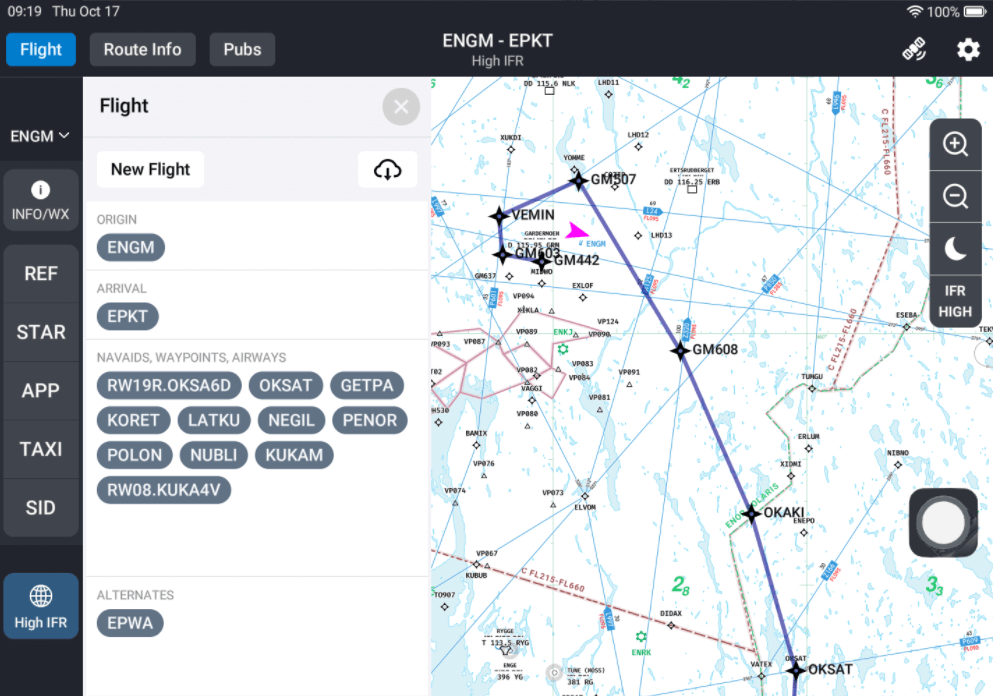
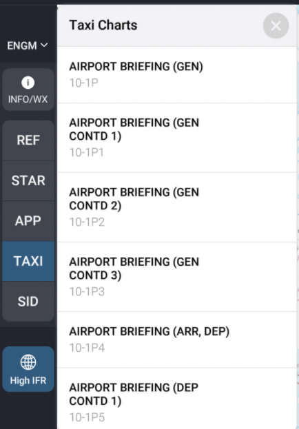
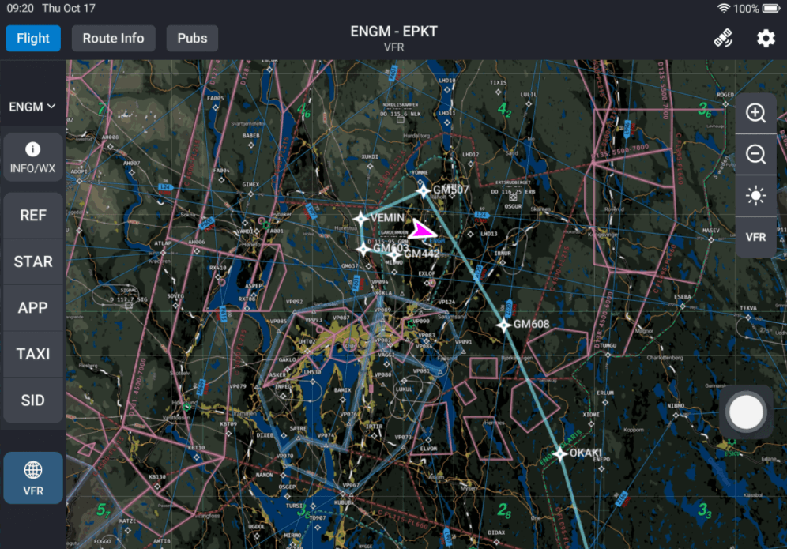

# Navigraph

This app allows you to view airport and enroute charts from Navigraph.

:::info

This app requires a Navigraph Unlimited subscription.

:::

## Signing in

The first time you open this app, you will be prompted to sign in to your Navigraph account. Scan the QR code and log in, or navigate to the provided link.

## Initializing your flight

Click on the `Flight` button in the top left corner.

Click on the cloud icon to fetch your flight from SimBrief.

## Selecting airport

Once you have initialized your flight, your departure airport will automatically be selected. To change the selected airport, click on the selector in the left bar.

You can either switch between your origin, destination and alternate airports or search for a different airport.

## Viewing airport charts

To view an airport chart, select the chart category in the left bar, then select the chart.

### Controls

From top to bottom:
- Zoom in
- Zoom out
- Rotate right
- Rotate left

## Enroute charts

### Controls

From top to bottom:
- Zoom in
- Zoom out
- Switch theme
- Switch mode (High IFR, Low IFR, VFR, World)

## INFO/WX

### Info

Displays information about the selected airport.

### WX & ATIS

Displays METAR, TAF and ATIS.

### Comms

Displays ATC frequencies.

