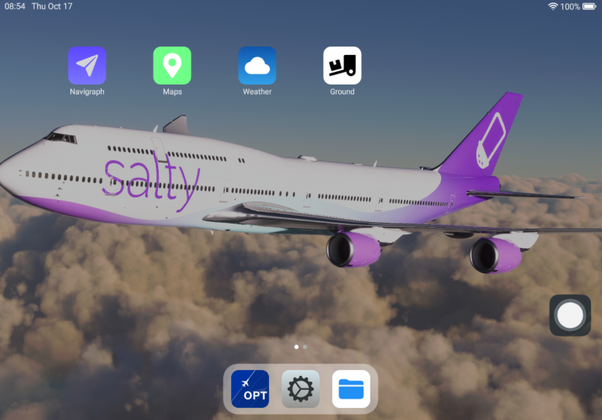

# Overview

The electronic flight bag is a tool that allows you to view charts, operational flight plans and routings, track your flight, check weather conditions and more. The EFB integrates with a multitude of third party services, such as Navigraph and FlyByWire SimBridge, to provide the best experience.

:::note

Unlike most other EFBs in simulators, the 74S EFB is inspired by a set of real-world EFB software and apps. We think this approach makes its use more immersive.

:::

## Home

The homescreen is where you open the different apps in the EFB. Currently, the available apps are
* [Navigraph](navigraph)
* [Maps](maps)
* [Weather](weather)
* [Ground](ground)
* [Settings](settings)
* [Files](files)

This guide goes through each app in detail.

### Navigating the EFB

You can go back to the homescreen anytime by pressing the virtual home button, located in the bottom right corner.
