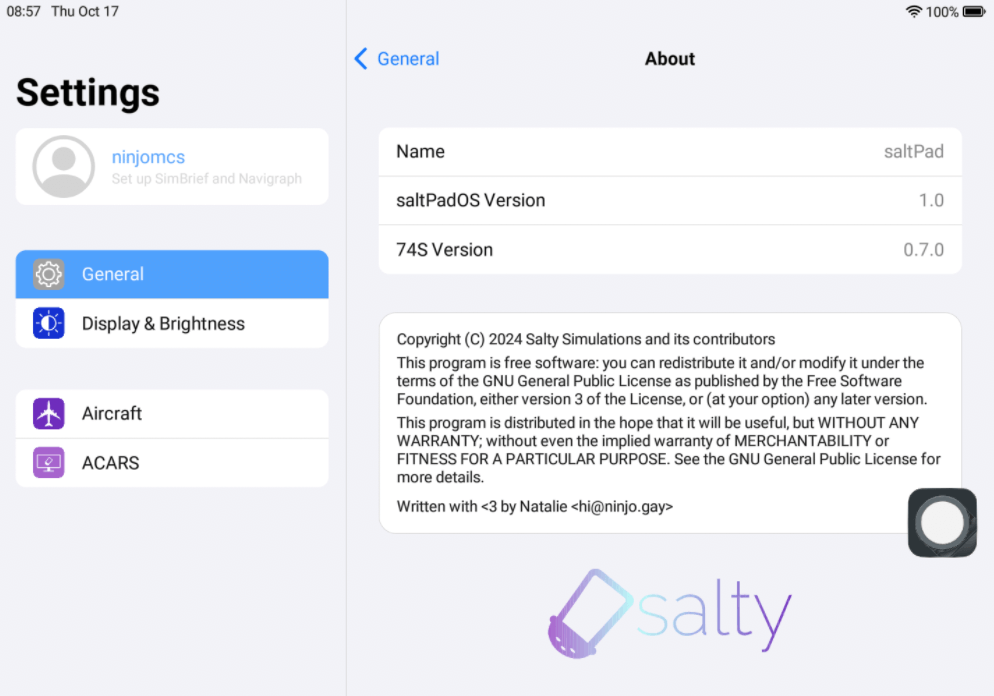
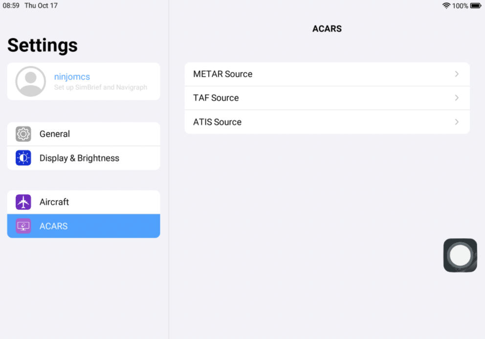

# Settings

The settings app allows you to adjust the EFB and aircraft settings, and set up SimBrief and Navigraph integration. Settings options that are grayed out are currently unavailable.

## Accounts

This is where you input your SimBrief username.

## General

### About

This page contains information about the installation's version and license.

## Display & Brightness

This page allows you to switch between a light and dark theme, as well as changing the brightness.

## Aircraft

Adjust various WT aircraft settings and SimBridge port.

:::note

These settings will automatically sync up with the WT settings in the CDU.

:::

## ACARS

Change METAR, TAF and ATIS sources.