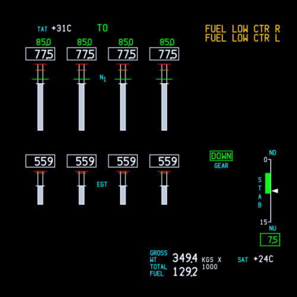
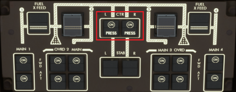
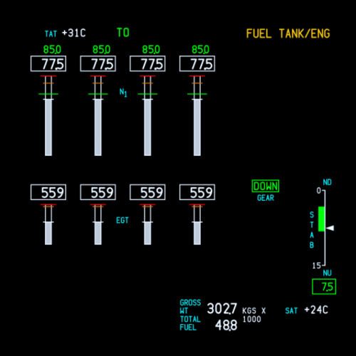
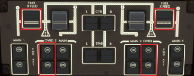

# Fuel Management

Unlike many other airliners, the 747 fuel system can be quite complex and requires a number of manual interventions throughout the flight. This is simulated in the 74S, and you may run into issues if you don't follow these steps.

:::note
This guide assumes all tanks are full. In the likely case that your fuel configuration is different, simply skip to the applicable step. For example, if you have no fuel in the Center Wing Tank or Stab Tank, go to [FUEL TANK/ENG EICAS message](#fuel-tank-eng).
:::

## Stages of Flight
This guide will go through the different stages of flight at which manual interventions are required.

### Start of Flight

The aircraft burns fuel only from the Center Wing Tank (CWT).

### STAB Tank Transfer to CWT

Once the CWT reaches 80,000 lbs (36,300 kg), the fuel in the horizontal STAB tank will transfer forward to the CWT. When this is finished, **turn off the STAB pumps**.

### When CWT is Empty

Once the CWT is empty, the EICAS `FUEL LOW CTR R/L` messages will display.

**You must now switch off the CTR pumps**:

The aircraft should now be feeding all four engines from the inner Main Tanks 2 & 3.

### FUEL TANK/ENG EICAS Message {#fuel-tank-eng}

The `FUEL TANK/ENG` EICAS message means that the outboard (+ reserve) and inboard tanks are now balanced.

**You must now switch off OVRD/JETTISON pumps 2 & 3 and close crossfeed valves 1 & 4**:

### Final Configuration

If done correctly, each tank should now be feeding its respective engine (as in the image). The reserve tank 1 & 4 fuel will automatically transfer when the mains reach 13,500 lbs (6100 kg). No further action is required.

