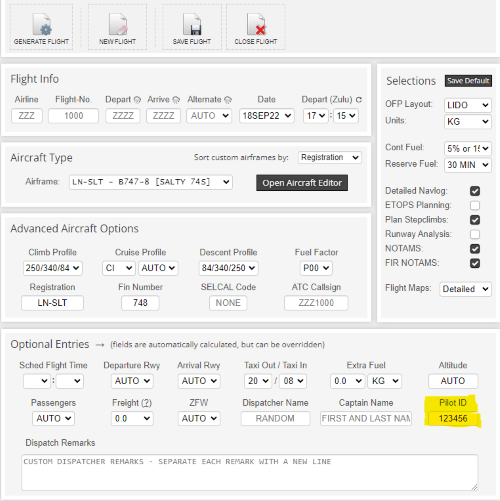
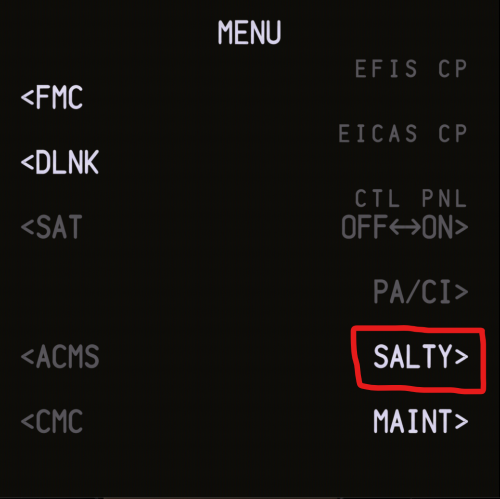
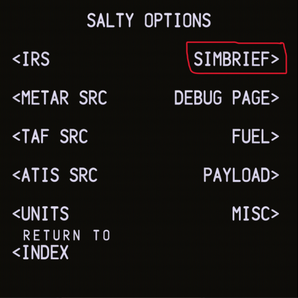
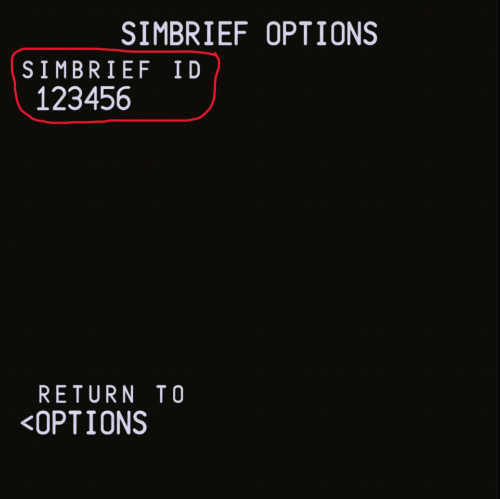
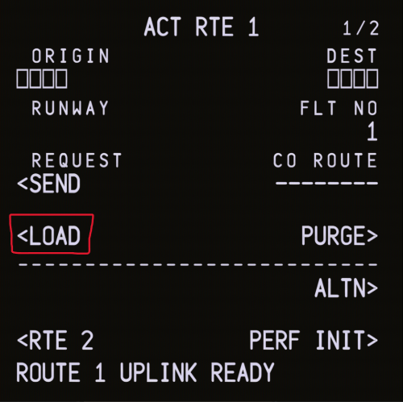
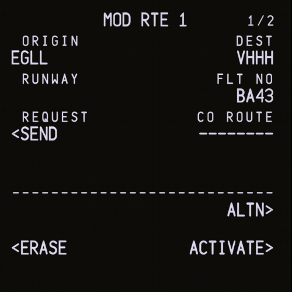

# SimBrief

:::note Video
This guide is also available in [video form](https://youtu.be/cSY-r83pXio) on our YouTube channel.
:::

:::info
This guide assumes you already have a Navigraph account and know how to set up a SimBrief flight plan. If you do not, our [video](https://youtu.be/cSY-r83pXio) covers this in detail.
:::

## Finding Your Pilot ID
Before you can start importing your SimBrief flight plans into the aircraft, you must first know what your SimBrief User ID is. This allows the aircraft to fetch your flight plan from SimBrief.

This six-digit ID can be found beneath your specified cruising altitude **BEFORE** generating your flight, as shown below:

## Integrating SimBrief in the aircraft
Now that you know your SimBrief Pilot ID, you can now use this to integrate SimBrief with the Salty 74S. 

From the `MENU` page in the CDU, navigate to the `SALTY` page by clicking on the corresponding LSK. 

Next, navigate to the `SIMBRIEF` page by clicking on the corresponding LSK

Finally, enter your SimBrief Pilot ID (as found earlier in this section) by inputting the six-digit number using the keypad.

## Importing a Flightplan
Finally, you are able to import your SimBrief flight plan into the aircraft!

Firstly, navigate to the route page using `RTE` key on the CDU.

Then, click on `ROUTE REQUEST` to draw your SimBrief flight plan into the aircraft.

Wait a moment for the flight plan to be loaded, and you will be greeted with the option to `LOAD` the flight plan.

Once this is complete, you will be greeted with a screen like this:

Wait until the flight plan is completely loaded (this could take a minute or so depending on the size of the flight). If you are happy, click on the green-illuminated `EXEC` button beneath the CDU to confirm the import.

:::info
After you have imported your SimBrief flightplan into the Salty 74S; we recommend scanning through the route to ensure that everything has worked as expected. Do this by clicking on the `LEGS` key on the CDU to analyse your route. If something is not right, check your flightplan on SimBrief and try this process all over again.
:::