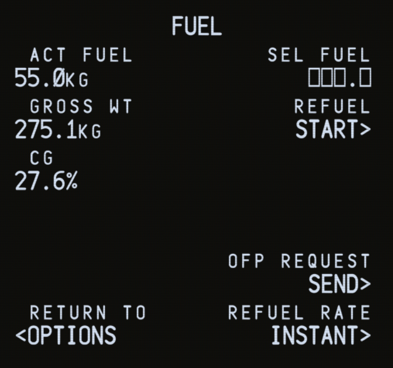

# Weight And Balance

To ensure a smooth and convenient loading and fueling process, the Salty 74S has a custom boarding and fueling feature, which can be accessed in the CDU (Control Display Unit).

:::caution
Do not attempt to use the default Microsoft Flight Simulator loading feature with the 74S.
:::

## Accessing the Fuel and Payload Pages

In order to access the Fuel and Payload pages, press the `MENU` key on the CDU. Then navigate to `SALTY`. The Fuel and Payload pages can be accessed through this page.

## Pages Overview

### Fuel Page

On the left side is the total amount of fuel currently on board, the gross weight, as well as the center of gravity (%MAC). On the right side is the field to select an amount of fuel, start refueling, request the fuel from your SimBrief OFP as well as changing the refuel rate.

### Payload Page

On the left side is the amount of cargo on board, passengers boarded, total payload (cargo + passengers), the zero fuel weight as well as the zero fuel weight CG (%MAC). On the right side are the fields to select the amount of cargo as well as passengers, start boarding, show the [pax details](#pax-details-page), request weights from your SimBrief OFP as well as changing the boarding rate.

## Selecting Weights

### Using SimBrief
:::info
For best results, use our [custom SimBrief airframe](https://www.simbrief.com/system/dispatch.php?sharefleet=141372_1660066082616) to generate your flight plan.
:::

:::info
This section assumes you have correctly set up [SimBrief integration](/guides/simbrief).
:::

Getting the desired amount of fuel from SimBrief is as simple as making sure your SimBrief OFP has been generated, and then pressing `SEND` under `OFP REQUEST`. This will fetch and automatically input the correct amount of fuel from your flight plan.

### Manual Selection

In order to select your desired amount of fuel, cargo or passengers, type the amount in the scratchpad and input it into the `SEL FUEL`, `SEL CARGO` and `SEL PAX` fields by pressing the LSKs (Line Select Keys) next to them.

## Starting the Fueling and Boarding Process

Once you have selected or imported your desired amount of fuel, press `START` under `REFUEL`. The aircraft should now be refueling. Similarly, once you have selected or imported your cargo and passengers, `START` under `BOARDING`.

:::tip
It is possible to change the rate at which fueling or boarding occurs by pressing `REFUEL RATE`.
:::

## PAX DETAILS Page

The `PAX DETAILS` page shows you in which zones the boarded passengers are located. Zones `A`-`E` are located on the main deck, while zone `UD` is on the upper deck.